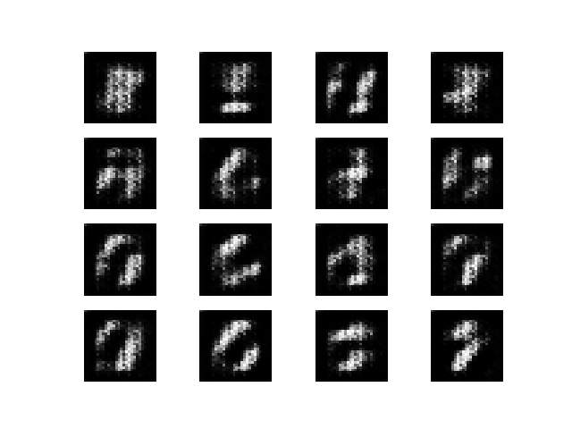
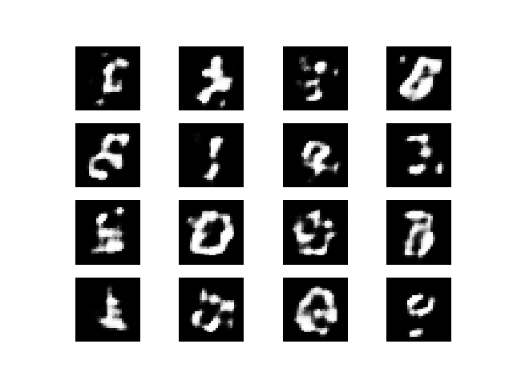
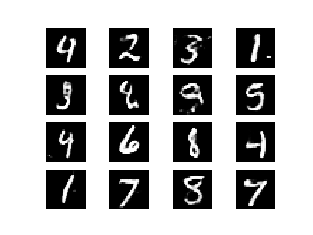
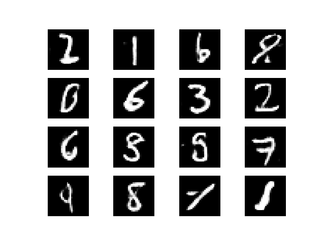

## GAN generation with MNIST

The purpose of this project is to build a simple GAN model to generate MNIST digits from the dataset.

##  1. Description

( Describes the problem that is being solved, the source of the data, inputs, and outputs. )

The aim of the project is to build a simple autogenerative model using the GAN architecture to learn the underlying representation of the MNIST dataset and be able to derive a generator model capable of re-creating MNIST digits.

The MNIST dataset is a well-known dataset commonly used in computer vision starter projects. The dataset is obtained from [http://deeplearning.net/tutorial/gettingstarted.html](http://deeplearning.net/data/mnist/mnist.pkl.gz)

It comprises of 70000 grayscale images of handwritten numbers from 0 to 9, which are 28x28 in dimensions each. The dataset is split into train, validation and test sets with the following ratio: 50000, 10000, 10000.

The dataset is preprocessed before feeding it into the GAN model. The preprocessing steps are explained in detail later. 

The expected output is a grayscale image of a MNIST digit between 0 to 9.

## 1.b Model description

A set of baseline generator and discriminator models are defined in `gan_model.py`. The discriminator model is a multi-layered CONV net which downsamples the input image from 28x28x1 to a 2048 vector. The aim of the discriminator is to determine if a given image is real or fake hence it uses sigmoid as its activation function in the output layer and loss is minimized using binary crossentropy.

The purpose of the generator is to generate images which appear real enough for the discriminator to classify as real. The model accepts a random uniform distribution of a fixed dimension, say 100, and upsamples it through a series of deconvolutional layers to generate a 28x28x1 image at the output layer. The generator model is not compiled unlike the discrimnator as it is not trained directly but as part of a larger logical model.

Both the generator and discriminator are not trained in isolation but as part of a larger logical GAN model which is main architecture. Within the GAN model, the discriminator's weights are set to untrainable which means that the generator's weights are updated via the discriminator's loss function. This is the standard minimax loss for the GAN architecture since both models are trained simultaneously in a zero-sum game


## 2. Test Harness

( Describes how model selection will be performed including the resampling method and model evaluation metrics. )

A manual process is often used for model selection whereby a model is saved at specific intervals during training process with a sample of the generator's output. The process of model selection involves going through the generated sample and selecting the corresponding model which has generated the highest quality images.

A more robust evaluation measure would be to utilize the Frechet Inception Score (FID) which measures the similarity distance between the generated and real images. This is carried out in the evaluation stage where we compare the generated images against the validation and test sets.


## 3. Baseline performance

( Describes the baseline model performance (using the test harness) that defines whether a model is skillful or not. )

The baseline model described above was trained for 50 epochs with a batch size of 256 and the latent dimension for seeding the generator was set to 100.

The discriminator loss on real and fake images as well as the GAN model loss on fake images are looged to the console.

A sample of the log output from the training run is shown below. It can be seen that the discriminator's loss fluctuates widely in the initial stages of training, falling close to 0 which could indicate a convergence failure but further training epochs show that the loss begins to stabilize between a range of 0.6 - 0.7.

The GAN model loss starts off high but eventually stabilize to within the range of 0.79 - 0.83 which is an acceptable range for a stable training process.

```
[INFO] Epoch: 1, d1=0.693, d2=1.084, g=0.726
[INFO] Epoch: 2, d1=0.656, d2=0.706, g=0.754
[INFO] Epoch: 3, d1=0.632, d2=0.659, g=0.793
[INFO] Epoch: 4, d1=0.604, d2=0.606, g=0.880
[INFO] Epoch: 5, d1=0.559, d2=0.526, g=1.066
[INFO] Epoch: 6, d1=0.470, d2=0.406, g=1.429
[INFO] Epoch: 7, d1=0.390, d2=0.282, g=1.867
[INFO] Epoch: 8, d1=0.244, d2=0.164, g=2.363
[INFO] Epoch: 9, d1=0.152, d2=0.095, g=2.781
[INFO] Epoch: 10, d1=0.062, d2=0.043, g=3.158
[INFO] Epoch: 11, d1=0.035, d2=0.028, g=3.466
[INFO] Epoch: 12, d1=0.046, d2=0.033, g=3.798
[INFO] Epoch: 13, d1=0.015, d2=0.015, g=3.979
[INFO] Epoch: 14, d1=0.010, d2=0.012, g=4.254
[INFO] Epoch: 15, d1=0.011, d2=0.012, g=4.575
[INFO] Epoch: 16, d1=0.007, d2=0.008, g=4.969
[INFO] Epoch: 17, d1=0.012, d2=0.011, g=5.567
[INFO] Epoch: 18, d1=0.011, d2=0.006, g=5.558
[INFO] Epoch: 19, d1=0.005, d2=0.004, g=6.042
[INFO] Epoch: 20, d1=0.003, d2=0.002, g=6.170
......

[INFO] Epoch: 9746, d1=0.710, d2=0.649, g=0.804
[INFO] Epoch: 9747, d1=0.686, d2=0.660, g=0.826
[INFO] Epoch: 9748, d1=0.639, d2=0.712, g=0.803
[INFO] Epoch: 9749, d1=0.706, d2=0.700, g=0.838
[INFO] Epoch: 9750, d1=0.673, d2=0.683, g=0.798

```

Manual inspection of generated images show that images from later training epochs are more accurate than images generated earlier.

For example, a sample of generator images at epoch 195 below shows random noise.

Epoch 195:


At epoch 390, the images are taking shape of being recognised digits.

Epoch 390:


By epoch 3900, we can see recognizable digits although some images are still blurred.


By the final epoch of 9750, we can see crisper shapes for the digits although some are still malformed.



## 4. Experimental Results

( Presents the experimental results, perhaps testing a suite of models, model configurations, data preparation schemes, and more. Each subsection should have some form of:
4.1 Intent: why run the experiment?
4.2 Expectations: what was the expected outcome of the experiment?
4.3 Methods: what data, models, and configurations are used in the experiment?
4.4 Results: what were the actual results of the experiment?
4.5 Findings: what do the results mean, how do they relate to expectations, what other experiments do they inspire? )

## 5. Improvements

( Describes experimental results for attempts to improve the performance of the better performing models, such as hyperparameter tuning and ensemble methods. )

## 6. Final Model

( Describes the choice of a final model, including configuration and performance. It is a good idea to demonstrate saving and loading the model and demonstrate the ability to make predictions on a holdout dataset. )

## 7. Extensions

( Describes areas that were considered but not addressed in the project that could be explored in the future. )

## References

[MNIST dataset](http://deeplearning.net/data/mnist/mnist.pkl.gz)